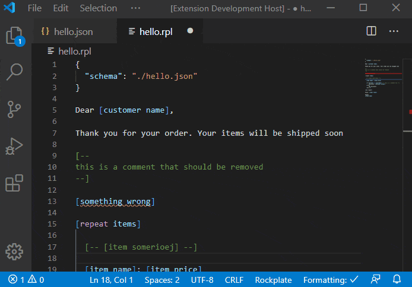

# Rockplate Support

This extension provides full support for the next generation Templating language [Rockplate](https://rockplate.github.io/)

## Features

- Syntax Highlighting for `.rpl` and `.rphtml` files
- Linter with Errors and Warnings
- Scope-aware auto completion (IntelliSense)
- Hover support

## Release Notes

### 1.0.x

Initial release

---

### [Rockplate Homepage](https://rockplate.github.io/)
